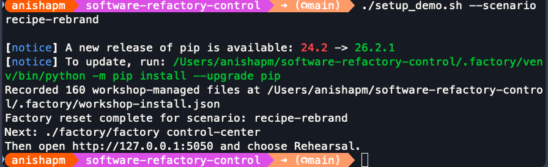
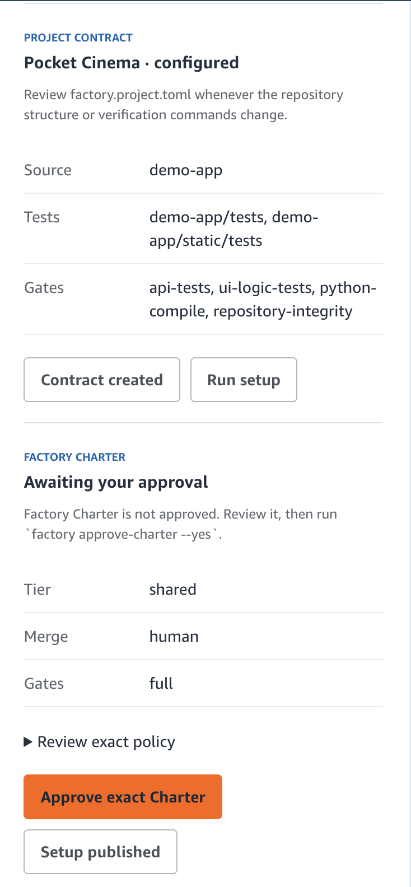
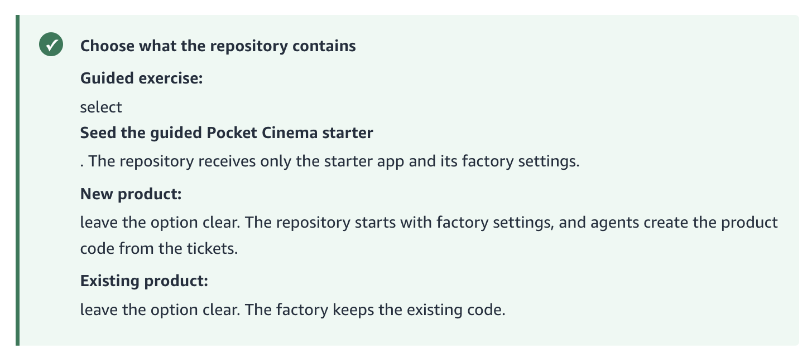

# Workshop Review Notes — Anisha

Review of `software-refactory-workshop`
Branch: `review/anisha` (based on `workshop-v1.1.3`)
Started: 2026-08-28

---

## Setup

- Node 20 crashed vinext (needs Node 22+ for `glob` from `node:fs/promises`).
- Installed Node 22.23.2 via nvm. **Friction:** `package.json` doesn't hard-fail on Node <22, just warns. Worth adding an `engines` check or a preflight script so testers don't hit a cryptic ESM error.
- `npm install` clean apart from Node engine warnings (miniflare, vinext, wrangler all want >=22).
- `npm run dev` — running on http://localhost:3000/ once on Node 22.

## Website walkthrough

_Filling in as I go._

### Landing / intro

-

### Rehearsal mode

- Contradiction: the mode-select screen says Rehearsal "does not change GitHub" — but then the first step asks you to clone a repo. Cloning is a GitHub action even if nothing gets pushed back. Confusing for a first-timer who just chose the "no GitHub" option. Either reword the mode-select ("Nothing gets pushed to GitHub" is more accurate) or explain up front that cloning is read-only and required for the local walkthrough.
- Step 1 is very confusing — lots of images but no actual substeps. Reader can't tell what to do vs what to look at. Break the page into numbered actions ("1. Run this command. 2. You should see this. 3. Then do X.") and use images as reference for each step, not as the step itself.

### Live mode (real run against a fresh GitHub repo)

- Suggestion: let Live mode also work against an example / starter repo, not just a brand-new empty one. Right now the ask is "bring your own empty repo" — but a lot of first-time users don't have a project idea ready and would happily follow along on a provided sample repo. Same "real GitHub run" experience, less friction to start.

### Control Center (web)

-

### CLI usage

-

## `npm run edit` — visual editor

## _First impressions of the edit mode:_

## Bugs / broken things

| Where | What | Severity | Fix idea / PR |
| ----- | ---- | -------- | ------------- |
| `./setup_demo.sh --scenario recipe-rebrand` terminal output | Says "Then open http://127.0.0.1:5050 and choose Rehearsal" but the link doesn't work. See screenshot below. Missing step? Wrong port? Or control-center never actually started? | High — dead end for a first-timer | Investigate whether control-center is meant to start automatically or the message is misleading you into skipping the `./factory/factory control-center` step. |
| Control Center → "Check readiness" (Live mode) | Fails with `[WARN] codex adapter not found or not signed in`, exit code 1. Message doesn't tell you how to fix it — no install command, no `codex login` hint, no link to setup docs. The follow-up screen says "correct the first reported error, then repeat this action" which is generic and unhelpful. Also, tagging a message `[WARN]` but exiting non-zero is inconsistent — it's an error, call it one. | High — blocks first-timer at the very first Control Center action | Turn the warning into an actionable error: "Codex CLI not found or not signed in. Install it (link) and run `codex login`, then retry." Also consider auto-detecting which adapters the current scenario actually needs, so you only fail readiness on the ones the user picked. |

### `setup_demo.sh` — link at end doesn't work

### Project Contract + Factory Charter panel — no idea what's going on

No orientation on this screen. Jargon everywhere ("Project Contract", "Factory Charter", "Tier: shared", "Merge: human", "Gates: full") with no definitions. Two buttons under Contract ("Contract created" / "Run setup") — is "Contract created" a status or a button? The charter section says "run `factory approve-charter --yes`" but also has an "Approve exact Charter" button — do I click or run the CLI? Are they equivalent? Nothing tells the reader which step comes first or what these things even are.

## Unclear / confusing copy

| Page / step                  | What's unclear                                                            | Suggested rewrite                                                                                                |
| ---------------------------- | ------------------------------------------------------------------------- | ---------------------------------------------------------------------------------------------------------------- |
| "Select your path"           | "Recommended first" — recommended for who?                                | "Start here on your first run"                                                                                   |
| "Select your path"           | Not clear when to pick Rehearsal vs Live.                                 |                                                                                                                  |
| "Select your path"           | "It does not change GitHub" is vague. Change what?                        | "Runs on your laptop only. Nothing gets pushed to GitHub."                                                       |
| "Select your path"           | "signed-in coding agents" is jargon. Signed into what?                    | "Uses AI coding agents you've logged into, like Claude Code or Codex."                                           |
| "Choose what the repository contains" | Whole screen needs to be clearer. See screenshot below. | |

### "Choose what the repository contains" — needs to be clearer

## Nice-to-haves / polish

-

## Stretch: add another AI CLI adapter

_(Kiro / Copilot — optional. Prompt in Gio's message.)_

- [ ] Which agent to try:
- [ ] Notes from adapter integration:

## PRs opened

-
