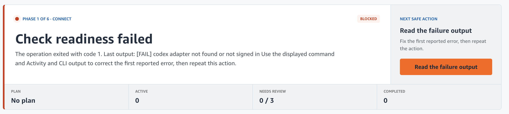
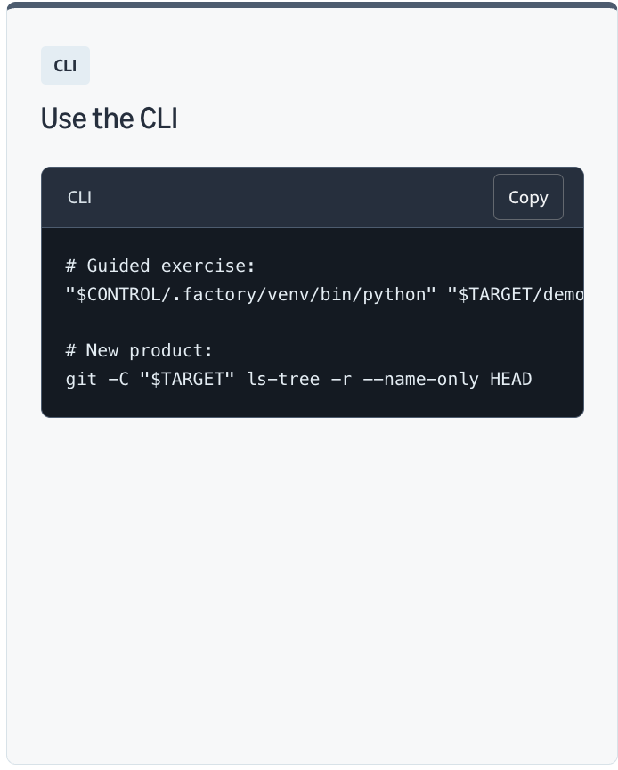

# Workshop Review Notes — Anisha

Review of `software-refactory-workshop`
Branch: `review/anisha` (based on `workshop-v1.1.3`)
Started: 2026-08-28

---

## Overall

- Switching between 3 repos is a lot to track. Reader has to keep tabs on the workshop repo, the demo/target repo, and the factory repo (plus wherever the AI CLI is signed in), and it isn't clearly laid out which one you're in at any given step. It would help to have a single up-front diagram showing the three, what each is for, and which one each instruction runs in — and to prefix commands with the repo they belong in.
- When a command is shown, it would help to say **what it does and where to run it**. Right now some blocks of commands appear without explanation — no one-line "this checks X" and no "run this in the $TARGET repo terminal", so a first-timer has to guess. Every command block would benefit from: a one-line purpose, which repo/directory to run it in, and what a successful result looks like.
- Concrete example of both of the above: I struggled to connect my repo in the Connect phase and found it hard to tell where I was meant to be — which repo, which terminal, which command belonged to which. The "Check readiness failed" screen (screenshot below) signals that something's wrong but doesn't give a map of the pieces involved, so I couldn't tell whether the problem was my repo, my shell, my env vars, or the adapter. A bit of orientation up front (which terminal is which, which repo is which) would help a lot.



---

## Setup

- Node 20 crashed vinext (needs Node 22+ for `glob` from `node:fs/promises`).
- Installed Node 22.23.2 via nvm. **Friction:** `package.json` doesn't hard-fail on Node <22, just warns. Worth adding an `engines` check or a preflight script so testers don't hit a cryptic ESM error.
- `npm install` clean apart from Node engine warnings (miniflare, vinext, wrangler all want >=22).
- `npm run dev` — running on http://localhost:3000/ once on Node 22.

## Website walkthrough

### Rehearsal mode

- Small contradiction: the mode-select screen says Rehearsal "does not change GitHub" — but the first step then asks you to clone a repo. Cloning is technically a GitHub action even if nothing gets pushed back, which can be confusing for a first-timer who just chose the "no GitHub" option. It might read more clearly as "Nothing gets pushed to GitHub", or a short note up front that cloning is read-only and required for the local walkthrough.
- Step 1 could be easier to follow — lots of images but no explicit substeps, so it's hard to tell what to do vs what to look at. Breaking the page into numbered actions ("1. Run this command. 2. You should see this. 3. Then do X.") and treating images as reference for each step (rather than as the step itself) would help.

### Live mode (real run against a fresh GitHub repo)

- Suggestion: let Live mode also work against an example / starter repo, not just a brand-new empty one. Right now the ask is "bring your own empty repo" — but a lot of first-time users don't have a project idea ready and would happily follow along on a provided sample repo. Same "real GitHub run" experience, less friction to start.

### Control Center (web)

- **In the Control Center I couldn't get anything connected, and the reason wasn't clear from the UI.** Each "Connect" action failed without pointing to which of the possible causes was the actual one. Running `factory/factory doctor --full` from the terminal eventually surfaced a proper punch list (6 failures, 3 warnings) — but a first-timer wouldn't know that command exists or that it's the escape hatch. Two things would help: (1) have Control Center run doctor itself and show these failures inline with fix hints, rather than the generic "Check readiness failed" message; (2) put the doctor output one click away from any blocked action. Doctor output from my run:

    ```
    [FAIL] clean checkout            M REVIEW-NOTES.md
    [FAIL] GitHub repository target  save the attendee repository URL in Connect or with `factory configure --github-repository URL`
    [FAIL] default branch            local `review/anisha`; GitHub `main`
    [FAIL] branch synchronization    local 7522b51a vs remote 8c5915bf
    [FAIL] codex adapter             not found or not signed in
    [FAIL] gate: api-tests           /Users/anishapm/.kepler/kntools/sdk/0.18.8/.pyenv/versions/3.12.6/bin/python3: No module named pytest
    [WARN] GitHub reviewer identity  FACTORY_REVIEW_GH_TOKEN not set; self-reviews use a labelled Factory comment
    [WARN] cursor adapter            not installed
    [WARN] port 5050                 already in use; choose another workshop port

    Doctor: 25 passed, 3 warnings, 6 failures
    ```

    None of these six failures came through in the Control Center UI — I only saw the generic "Check readiness failed" screen. Worth noting too: several of these ("clean checkout", "default branch", "branch synchronization") are only failures *because I'm a reviewer working on the review branch*, and wouldn't apply to a typical attendee. Doctor could distinguish "attendee blockers" from "reviewer state" so the report reads more accurately for the intended audience.

### CLI usage

- "Use the CLI" screen shows two command blocks (`# Guided exercise:` and `# New product:`) without much context (screenshot below). There's no explanation of what `$CONTROL` and `$TARGET` are, where to run these, or what each command does. A first-timer seeing `"$CONTROL/.factory/venv/bin/python" "$TARGET/demo...` would find it hard to tell whether it's meant to be pasted as-is, whether the env vars are already set, or which shell / repo it belongs in. Each command block here would benefit from: a one-line purpose, the directory to run it in, and how to tell it worked.



## `npm run edit` — visual editor

## _First impressions of the edit mode:_

## Bugs / broken things

| Where                                                       | What                                                                                                                                                                                                                                                                                                                                                                                                            | Severity                                                          | Fix idea / PR                                                                                                                                                                                                                                                                    |
| ----------------------------------------------------------- | --------------------------------------------------------------------------------------------------------------------------------------------------------------------------------------------------------------------------------------------------------------------------------------------------------------------------------------------------------------------------------------------------------------- | ----------------------------------------------------------------- | -------------------------------------------------------------------------------------------------------------------------------------------------------------------------------------------------------------------------------------------------------------------------------- |
| `./setup_demo.sh --scenario recipe-rebrand` terminal output | Says "Then open http://127.0.0.1:5050 and choose Rehearsal" but the link doesn't work. See screenshot below. Missing step? Wrong port? Or control-center never actually started?                                                                                                                                                                                                                                | High — dead end for a first-timer                                 | Investigate whether control-center is meant to start automatically or the message is misleading you into skipping the `./factory/factory control-center` step.                                                                                                                   |
| Control Center → "Check readiness" (Live mode)              | Fails with `[WARN] codex adapter not found or not signed in`, exit code 1. The message doesn't point to a fix — no install command, no `codex login` hint, no link to setup docs. The follow-up screen says "correct the first reported error, then repeat this action", which is quite generic. Also, tagging a message `[WARN]` but exiting non-zero is a bit inconsistent — worth surfacing it clearly as an error.                                                       | High — blocks first-timer at the very first Control Center action | Consider turning the warning into an actionable error: "Codex CLI not found or not signed in. Install it (link) and run `codex login`, then retry." Also possibly auto-detect which adapters the current scenario actually needs, so readiness only fails on the ones the user picked. |

### `setup_demo.sh` — link at end doesn't work


### Project Contract + Factory Charter panel — needs more orientation


This screen could use more orientation. There's a lot of terminology ("Project Contract", "Factory Charter", "Tier: shared", "Merge: human", "Gates: full") without definitions in view. Two buttons under Contract ("Contract created" / "Run setup") — is "Contract created" a status or a button? The charter section says "run `factory approve-charter --yes`" but also has an "Approve exact Charter" button — should the reader click or run the CLI, and are they equivalent? It would help to spell out which step comes first and briefly define these terms.

## Unclear / confusing copy

| Page / step                           | What's unclear                                          | Suggested rewrite                                                      |
| ------------------------------------- | ------------------------------------------------------- | ---------------------------------------------------------------------- |
| "Select your path"                    | "Recommended first" — recommended for who?              | "Start here on your first run"                                         |
| "Select your path"                    | Not clear when to pick Rehearsal vs Live.               |                                                                        |
| "Select your path"                    | "It does not change GitHub" is vague. Change what?      | "Runs on your laptop only. Nothing gets pushed to GitHub."             |
| "Select your path"                    | "signed-in coding agents" is jargon. Signed into what?  | "Uses AI coding agents you've logged into, like Claude Code or Codex." |
| "Choose what the repository contains" | Whole screen needs to be clearer. See screenshot below. |                                                                        |

### "Choose what the repository contains" — needs to be clearer


-
