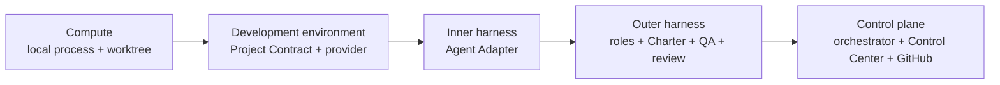
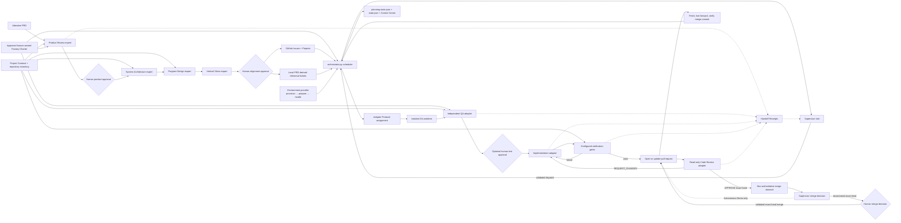

# Factory architecture map

The factory is intentionally small enough to inspect during a workshop, but the
entrypoint now coordinates planning, supervision, QA, execution, code review,
GitHub, and observability.
Use this guide instead of reading every file sequentially.

## Layer model



The interfaces are directional. Compute supplies a bounded workload;
the development-environment provider supplies a revision, tools, dependencies,
services, gates, and preview; the inner harness performs one assignment; the
outer harness constrains the role and evidence; and the control plane owns the
lifecycle. See [INTERFACES.md](INTERFACES.md) for the protocol and authority
contracts.

## Runtime flow



## Reading path

1. `factory.charter.toml` and `factory/factory_charter.py` — human-owned
   authority, risk, budgets, path policy, and merge boundary, bound to an
   explicitly approved policy hash.
2. `factory.project.toml` and `factory/project_contract.py` — repository
   structure, environment, QA placement, gates, reset behavior, and bounded
   agent context.
3. `factory/roles.json` and `factory/policy.json` — Agent Role contracts and
   versioned general policy.
4. `factory/factory.toml` and `.factory/local.toml` — committed adapter
   definitions and ignored attendee selections.
5. `factory/CONFIGURATION.md` — configuration precedence and adapter setup.
6. `factory/planning_pipeline.py` — expert contracts, hashes, approvals,
   traceability, validation, and planning state.
7. `factory/planner.py` — Ticket-plan validation and GitHub publication.
8. `factory/orchestrator.py` — CLI, dependency scheduler, and Ticket lifecycle.
9. `factory/supervisor.py` — receipt-driven, validated coordination proposals.
10. `factory/code_review.py` — structured PR-review validation and rendering.
11. `factory/evidence_packet.py` — Canvas validation and sanitized export.
12. `factory/github_backend.py` — Issues, Projects, reviews, and merge state.
13. `factory/github_repository.py` — GitHub target validation and checkout.
14. `factory/doctor.py` — environment and governance diagnostics.
15. `factory/control_center.py` and `factory/control_center/` — local validated
    action API and operator interface.
16. `factory/mock_agent.py`, `mock_qa_agent.py`, `mock_supervisor.py`, and
    `mock_review_agent.py` — deterministic Rehearsal adapters.
17. `factory/adapter_protocol.py` and `factory/adapter_capabilities.py` —
    versioned assignments, events, results, and declared provider features.
18. `factory/environment_provider.py` — local provision, prepare, health,
    preview, reset, and destroy evidence.
19. `factory/intake_evidence.py` and `factory/trigger_contract.py` — governed,
    deduplicated proposals that cannot dispatch directly.
20. `factory/compounding_report.py` — reviewed cross-run improvement proposals.
21. `factory/merge_steward.py` — exact-head merge readiness and safe base
    synchronization without merge authority.
22. `factory/workspace_contract.py` — optional multi-repository revisions,
    ownership, services, dependency order, and verification.
23. `factory/complexity.py` — dependency-free complexity report and regression
    budget for production Python functions.

## Deep modules and dispatch seams

The control plane keeps broad behavior behind small public interfaces. The
patterns are selected for the failure mode they remove; they are not a second
framework layered over the factory.

- **Command Router.** `ControlCenter.build_commands()` and `FactoryCLI.run()`
  look up an allowlisted command family, then delegate to one cohesive builder
  or handler. Adding an action no longer extends a repository-wide conditional.
  Validation and mutation remain inside the owning command family.
- **Facade with diagnostic collectors.** `run_doctor()` is the stable interface
  to `DiagnosticSuite`. Repository, runtime, GitHub, adapter, and quality
  collectors share an ordered result without sharing decision logic.
- **Explicit State Machine.** Journey guidance resolves the first applicable
  state in a documented priority order. Ticket execution separates worktree and
  QA preparation from one implementation attempt; the lifecycle method owns
  retry and phase transitions.
- **Strategy and Adapter.** Agent adapters and environment providers implement
  versioned contracts behind replaceable interfaces. Lifecycle code depends on
  capabilities and results, not a provider-specific command shape.

Run the complexity gate after changing control-plane flow:

```bash
python3 factory/complexity.py factory --limit 75
python3 -m unittest factory.tests.test_complexity
```

The global budget prevents a new monolithic hotspot. Tighter tests protect the
public command dispatchers and the two primary state machines. A high score is
not repaired by moving the same conditional into a generic helper: extracted
modules must own a coherent policy or lifecycle phase.

## Control boundaries

- Every planning expert is read-only and receives the PRD, approved upstream
  artifacts, Project Contract, and exact approved Factory Charter.
- Product approval precedes technical planning; alignment approval precedes
  GitHub publication.
- Artifact hashes invalidate downstream work after human edits.
- The Factory Charter is the highest repository-local authority. The Project
  Contract defines mechanics, the Factory Profile defines topology, Agent Role
  contracts narrow responsibility, and versioned policy supplies general
  rules. Lower layers cannot weaken higher ones.
- The Project Contract is the repository-mechanics interface consumed by
  planning, QA policy, preflight, verification, and reset. A changed contract
  invalidates an in-progress plan before publication.
- Profile topology determines which roles and controls are applicable.
- Standard and Assured runs include a Supervisor role at each dispatch checkpoint.
  It reads worker Handoff Receipts and proposes Ticket-specific dispatch or
  block commands. Lean runs keep direct scheduler dispatch.
- The orchestrator, not an agent, issues every Handoff Receipt, validates every
  Supervisor proposal, executes explicitly authorized GitHub mutations, and
  remains the only lifecycle authority.
- Agent Adapters receive an Adapter Protocol assignment and may emit normalized
  progress and a structured final result. Legacy command adapters use the
  compatibility path. Declared capabilities are visible and cannot change an
  Agent Role's authority.
- The environment provider binds every lifecycle operation to the repository
  revision and Project Contract hash. `prepare` requires explicit approval;
  `reset` and `destroy` preserve source and remote GitHub evidence.
- Raw feedback and external triggers produce intake proposals only. A feature
  routes to planning; a reproducible bug requires a recorded human approval
  before triage can add `agent-ready`.
- Each ticket runs in its own worktree and branch.
- QA may add only new ticket-numbered files under configured test roots.
- Acceptance Test hashes prevent the Implementation adapter from weakening that evidence.
- Required gates must pass before the candidate branch is pushed and its PR is
  opened or updated.
- Standard and Assured runs give that exact PR candidate to a separate, read-only
  Code Review role. `REQUEST_CHANGES` returns every comment to implementation
  within the existing retry limit. Tests, gates, and review then run again.
- `APPROVE` is revision-specific and cannot include unresolved comments. The
  Supervisor may recommend `MERGE` only for that reviewed head, with passing
  required gates and a published review decision. Standard and Assured stop at
  the human exact-revision merge command. Only explicitly opted-in Autonomous
  Demo delegates execution of the validated recommendation to the orchestrator.
  Stale revisions and branch-protection failures fail closed.
- The merge steward may synchronize the candidate with the default branch when
  policy allows. Any changed head revokes gates and Code Review. It cannot
  resolve semantic conflicts, waive evidence, or merge.
- Compounding reports may suggest prompt, skill, gate, contract, adapter,
  profile, or documentation changes. They cannot edit or approve the Charter;
  accepted suggestions use a separate human-reviewed change.
- Optional trigger and workspace contracts extend intake and coordination.
  They never bypass planning, Charter, QA, review, or merge policy, and the
  single-repository local path remains the default.
- Lean keeps a direct human diff-and-merge review. In every profile, the factory
  verifies merged code is present locally before unlocking dependent tickets.
- Worktrees provide Git isolation, not a security boundary. Replace adapter
  commands with container or remote-runner wrappers when stronger isolation is
  required.

The Control Center exposes local engine-room evidence. GitHub Projects remains the
shared backlog and dependency view; the two interfaces are deliberately not
presented as the same system.

The four planning stages currently use Claude or Codex because their adapters
enforce the planning JSON schemas. Supervision, implementation, QA, and code review accept any lowercase
adapter name registered under `[agents]` in `factory/factory.toml`. This keeps
the control flow stable while teams swap models, CLIs, wrappers, or execution
environments.
